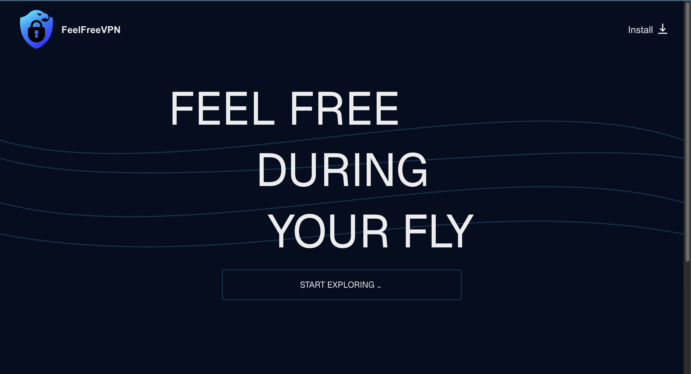

# FeelFree VPN — Next.js VPN service site + TG Bot client wrapper

This repository contains a Next.js site plus a Telegram-bot file that provides a client-version interface inside Telegram. Both the Next.js app and the bot endpoint are ready to be hosted on Vercel and the bot is designed to work via webhooks.

Quick summary
- Next.js frontend for the project UI and static assets.
- A Telegram bot handler (API route / serverless function) that serves the client-version menu and download links inside Telegram.
- The bot uses webhooks (set WEBHOOK_URL to your Vercel deployment) and can run as a serverless function on Vercel.
- Ready-to-use configuration files for Vercel (vercel.json and api/webhook.js) are included.

## Screenshot
How it looks:

Environment variables
- TELEGRAM_BOT_TOKEN — Telegram Bot token

Deployment notes
- Deploy both Next.js and the webhook API to Vercel; set env vars in the Vercel dashboard.
- Use serverless webhook endpoint (recommended) or an always-on server if needed.

License
- MIT

